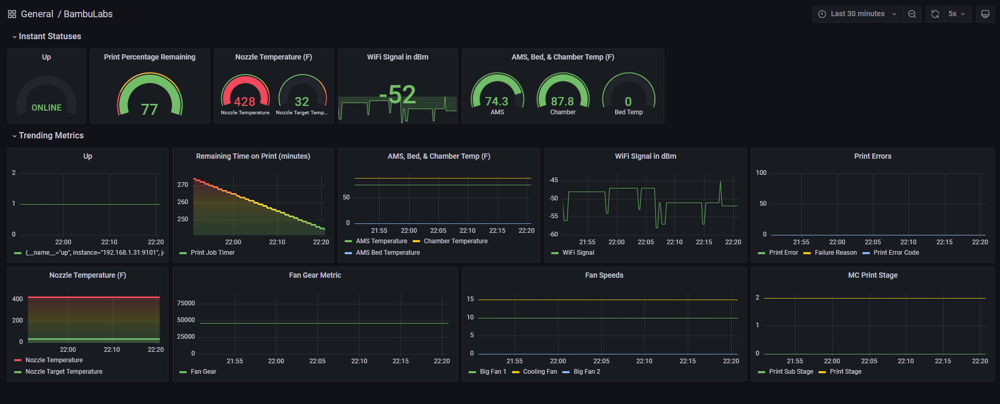

# BAMBULABS EXPORTER
This is an exporter for all the data peeps that want to know all the things about their awesome BambuLabs 3D Printer. This was only tested on the X1C.



## GO, DOCKER, & PROMETHEUS ⚡ Powered
This is an MQTT Exporter powered by Go & Docker. 

### Prometheus Metrics Available

| Metric   | Description | Examples |
| ------------- | ------------- |  ------------- |
| humidity  | Humdity of the Enclosure  | |
| ams_temp  | Temperature of the Bambu Bed  | |
| layer_number | GCode Layer number  | |
| print_error | Print Error Code Detected  | |
| wifi_signal | Wifi Signal in dBm  | |
| big_fan1_speed | Big1 Fan Speed  | |
| big_fan2_speed | Big2 Fan Speed  | |
| chamber_temper | Temperature of the Bambu Enclosure  | |
| cooling_fan_speed | Print Head Cooling Fan Speed  | |
| fail_reason | Failure Print Reason Code  | |
| fan_gear | Fan Gear   | |
| mc_percent | Print Progress in Percentage  | |
| mc_print_error_code | Print Progress Error Code | |
| mc_print_stage | Print Progress Stage | |
| mc_print_sub_stage | Print Progress Sub Stage | |
| mc_remaining_time | Print Progress Remaining Time in minutes  | |
| nozzle_target_temper |Nozzle Target Temperature Metric | |
| nozzle_temper | Nozzle Temperature Metric | |


## Steps to run the project
Step 1: Create the .env file (see the step below.)

Step 2: Clone the Repo

Step 3: Change Directory into the cloned repo.

Step 4: Run Docker Compose 

### .env File
Create an .env file.
Add the Printer IP you configured when you setup your printer.
Add the Printer Password from the Printer Network Settings Menu.
Add the MQTT_TOPIC for your printer. This can be achived by loading up an MQTT Application such as MQTT Explorer. 
- You must Enable (TLS), use the protocol mqtt://, add the port 8883, username bblp, and the password on your printer. 
- *Please note you can regenerate a password on the device manually.
- Collect the MQTT_TOPIC by expanding the "Device", "Serial Number", "Report". The result should look similar to "device/00M00A2B08124765/report"

```
BAMBU_PRINTER_IP=""
USERNAME="bblp"
PASSWORD=""
MQTT_TOPIC="device/00M00A2B0809765/report"
```

```
git clone
cd Bambulabs-Exporter
docker-compose up -d
```


## (Important Notes)
You will need to likely run an MQTT program to test your connection. You can pull the password from the printer interface manually, or reset it on the printer itself.

### Prometheus Ingestion
Setup prometheus to scrape the node and setup the ports to pull from port 9101.

### Future Development
Add Kubernetes Configs

### Credit
```Give me a shout if you utilize this code base (Anywhere!)```


### Support Questions 

```tylerwbennet@gmail.com```
